Torchlight Engine brings Torchlight's code annotation syntax to PHP, built on top of the excellent [Phiki](https://github.com/phikiphp/phiki) syntax highlighting package. **No node or API required**.

Torchlight enables you to add annotations to your code, drawing your reader's attention to specific parts, highlighting lines, visualizing diffs, and much more. Combined with the syntax highlighting provided by Phiki, Torchlight is a perfect fit for technical blogs, documentation, and so much more.

Torchlight annotations are written as comments in the language of your code sample, eliminating all red squigglies and errors within your editor or IDE.

As an example, here is how we could focus our reader's attention on lines 6 and 7:

```php
return [
    'extensions' => [
        // Add attributes straight from markdown.
        AttributesExtension::class,

        // Add Torchlight syntax highlighting. [tl! focus]
        TorchlightExtension::class, // [tl! focus]
    ]
]
```

When rendered, our readers would be presented with something like the following:

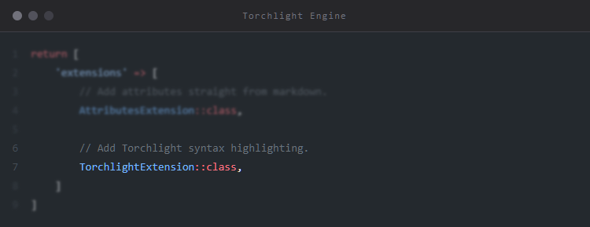

How simple is that? We're pretty proud of it and know you'll love it, too.

* [Installation](#installation)
* [Getting Started](#getting-started)
  * [Laravel](#laravel)
  * [Statamic](#statamic)
  * [Notes on User Provided Content](#notes-on-user-provided-content)
* [CSS and Theming](#css-and-theming)
  * [Standard CSS](#standard-css)
  * [Tailwind](#tailwind)
  * [Dark Mode](#dark-mode)
* [Annotations](#annotations)
  * [Plain Text Annotations](#plain-text-annotations)
  * [JSON Annotations](#json-annotations)
  * [Ranges](#ranges)
    * [Annotation Range Cheat Sheet](#annotation-range-cheat-sheet)
    * [Single Lines](#single-lines)
    * [N-Many Lines](#n-many-lines)
    * [Offset and Length](#offset-and-length)
    * [Start and End](#start-and-end)
    * [Supported Annotations](#supported-annotations)
  * [Highlighting Lines](#highlighting-lines)
    * [Alternative Highlight Class](#alternative-highlight-class)
    * [Highlight Shorthand](#highlight-shorthand)
  * [Focusing](#focusing)
    * [Focusing Shorthand](#focusing-shorthand)
    * [Focusing CSS](#focusing-css)
  * [Collapsing](#collapsing)
    * [Customizing the Summary Text](#customizing-the-summary-text)
    * [Collapsing Required CSS](#collapsing-required-css)
    * [Default to Open](#default-to-open)
  * [Diffs](#diffs)
    * [Diff Shorthand](#diff-shorthand)
    * [Removing Diff Indicators](#removing-diff-indicators)
    * [Standalone Diff Indicators](#standalone-diff-indicators)
    * [Diff Indicators Without Line Numbers](#diff-indicators-without-line-numbers)
    * [Diff Ranges](#diff-ranges)
  * [Classes and IDs](#classes-and-ids)
    * [Using Range Modifiers](#using-range-modifiers)
    * [Character Ranges](#character-ranges)
  * [Auto-linking URLs](#auto-linking-urls)
    * [Link Requirements](#link-requirements)
    * [Link Ranges](#link-ranges)
  * [Reindexing Line Numbers](#reindexing-line-numbers)
    * [Manually Setting a New Number](#manually-setting-a-new-number)
    * [No Line Number at All](#no-line-number-at-all)
    * [Relative Line Number Changes](#relative-line-number-changes)
    * [Reindexing with Range Modifiers](#reindexing-with-range-modifiers)
    * [Reindex Differences Between Torchlight API](#reindex-differences-between-torchlight-api)
  * [Options](#options)
  * [Line Numbers](#line-numbers)
  * [Summary Indicator](#summary-indicator)
  * [Disabling Annotations](#disabling-annotations)

## Installation

You may install Torchlight Engine via Composer:

```bash
# TODO: Update once added to the registry.
```

## Getting Started

Torchlight Engine provides a `league/commonmark` extension, making it simple to start using Torchlight in your markdown-powered content.

You may register the extension with any CommonMark `Environment` object like so:

````php
<?php

use League\CommonMark\Environment\Environment;
use League\CommonMark\Extension\CommonMark\CommonMarkCoreExtension;
use League\CommonMark\MarkdownConverter;
use Torchlight\Engine\CommonMark\Extension;

$environment = new Environment;
$environment
    ->addExtension(new CommonMarkCoreExtension)
    ->addExtension(new Extension('github-light'));

$converter = new MarkdownConverter($environment);
$output = $converter->convert(<<<'MD'
```php
<?php echo 'This is Torchlight'; ?>
```
MD);
````

### Laravel

> [!NOTE]
> This section highlights using the provided CommonMark extension with Laravel. Updated versions of the [Laravel client](https://github.com/torchlight-api/torchlight-laravel) are planned for the future.

You may use the provided CommonMark extension with Laravel's `Str::markdown()` or `str()->markdown()` methods by adding the extension to your method call:

```php
<?php

use Torchlight\Engine\CommonMark\Extension;

echo str()->markdown('...your markdown content...', extensions: [
    new Extension('github-light'),
]);
```

### Statamic

To integrate Torchlight Engine with Statamic, you may add the CommonMark extension to your desired markdown parser by [adding the extension](https://statamic.dev/extending/markdown#adding-extensions):

```php
<?php
namespace App\Providers;
 
use Illuminate\Support\ServiceProvider;
use Statamic\Facades\Markdown;
use Torchlight\Engine\CommonMark\Extension;
 
class AppServiceProvider extends ServiceProvider
{
    public function boot()
    {
        // Add the Torchlight Engine extension
        Markdown::addExtension(function () {
            return new Extension('synthwave-84');
        });
    }
}
```

### Notes on User Provided Content

[Phiki](https://github.com/phikiphp/phiki) and Torchlight Engine, while incredibly powerful, are still early projects, and it is possible to encounter infinite loops with some grammars and input. As always, you should exercise caution when rendering any user-provided content.

## CSS and Theming

Torchlight handles the highlighting of all of your code for you, but there are a few styles that you will likely need to add to your CSS to make it just right.

This is the CSS we prefer, which sets up some line padding, margin off of the line numbers, and overflow scrolling. Your CSS is totally up to you though!

### Standard CSS

This is the vanilla CSS version, see below for the TailwindCSS version.

```css
/*
 Margin and rounding are personal preferences,
 overflow-x-auto is recommended.
*/
pre {
    border-radius: 0.25rem;
    margin-top: 1rem;
    margin-bottom: 1rem;
    overflow-x: auto;
}

/*
 Add some vertical padding and expand the width
 to fill its container. The horizontal padding
 comes at the line level so that background
 colors extend edge to edge.
*/
pre code.torchlight {
    display: block;
    min-width: -webkit-max-content;
    min-width: -moz-max-content;
    min-width: max-content;
    padding-top: 1rem;
    padding-bottom: 1rem;
}

/*
 Horizontal line padding to match the vertical
 padding from the code block above.
*/
pre code.torchlight .line {
    padding-left: 1rem;
    padding-right: 1rem;
}

/*
 Push the code away from the line numbers and
 summary caret indicators.
*/
pre code.torchlight .line-number,
pre code.torchlight .summary-caret {
    margin-right: 1rem;
}
```

### Tailwind

Here is the Tailwind version:

```css
/*
 Margin and rounding are personal preferences,
 overflow-x-auto is recommended.
*/
pre {
    @apply my-4 rounded overflow-x-auto;
}

/*
 Add some vertical padding and expand the width
 to fill its container. The horizontal padding
 comes at the line level so that background
 colors extend edge to edge.
*/
pre code.torchlight {
    @apply block py-4 min-w-max;
}

/*
 Horizontal line padding.
*/
pre code.torchlight .line {
    @apply px-4;
}

/*
 Push the code away from the line numbers and
 summary caret indicators.
*/
pre code.torchlight .line-number,
pre code.torchlight .summary-caret {
    @apply mr-4;
}
```

### Dark Mode

Torchlight Engine utilizes Phiki for syntax highlighting, and recommends using it's multi-theme support for dark mode.

When instantiating an instance of the CommonMark extension, you may supply multiple themes like so:

```php
<?php

use Torchlight\Engine\CommonMark\Extension;

$extension = new Extension([
    'light' => 'github-light',
    'dark' => 'github-dark',
]);
```

The first entry, `light` in this case, will be used as the default theme. Other themes in the array may be conditionally rendered with CSS.

**Query-based dark mode:**

```css
@media (prefers-color-scheme: dark) {
    code.torchlight {
        background-color: var(--phiki-dark-background-color) !important;
    }

    .phiki,
    .phiki span {
        color: var(--phiki-dark-color) !important;
        font-style: var(--phiki-dark-font-style) !important;
        font-weight: var(--phiki-dark-font-weight) !important;
        text-decoration: var(--phiki-dark-text-decoration) !important;
    }
}
```

**Class-based dark mode:**

```css
html.dark code.torchlight {
    background-color: var(--phiki-dark-background-color) !important;
}

html.dark .phiki,
html.dark .phiki span {
    color: var(--phiki-dark-color) !important;
    font-style: var(--phiki-dark-font-style) !important;
    font-weight: var(--phiki-dark-font-weight) !important;
    text-decoration: var(--phiki-dark-text-decoration) !important;
}
```

You can learn more about rendering multiple themes with Phiki [here](https://github.com/phikiphp/phiki?tab=readme-ov-file#multi-theme-support). The only change when rendering multiple themes with Torchlight Engine is the placement of the `background-color` property, to prevent conflicts with some annotations, such as diff add and remove.

## Annotations

One of the things that makes Torchlight such a joy to author with is that you can control how your code is rendered via _comments in the code you're writing._

If you want to highlight a specific line, you can add a code comment with the magic syntax `[tl! highglight]` and that line will be highlighted.

Gone are the days of inscrutable line number definitions at the top of your file, only to have them become outdated the moment you add or remove a line.

Most other tools use a series of line numbers up front to denote highlight or focus lines:
````text
```php{3}{2,4-5}{9}
return [
    'extensions' => [
        // Add attributes straight from markdown.
        AttributesExtension::class,
        
        // Add Torchlight syntax highlighting.
        TorchlightExtension::class,
    ]
]
```
````

If you don't have the syntax memorized, it's hard to tell what those numbers mean. And of course when you add a line or remove a line, everything changes and you have to recalculate!

With Torchlight, you control your display with inline annotations in comments.

All inline annotations are wrapped within square brackets and start with `tl!`, leaving you with the following format: `[tl! ... ... ...]`.

For example, if you are using Torchlight to render the following block of PHP:

```php
return [
    'extensions' => [
        // Add attributes straight from markdown.
        AttributesExtension::class,
        
        // Add Torchlight syntax highlighting.
        TorchlightExtension::class,
    ]
]
```

and you wanted to draw attention to lines 6 & 7, you could focus those lines by using the `focus` annotation:

```php
return [
    'extensions' => [
        // Add attributes straight from markdown. 
        AttributesExtension::class,
        
        // Add Torchlight syntax highlighting. [tl! focus]
        TorchlightExtension::class, // [tl! focus]
    ]
]
```

Resulting in the following:


Notice that Torchlight is smart enough to not only strip the annotation from line 6, but the annotation _and_ comment syntax from line 7, leaving your code pristine.

If the entirety of the comment is Torchlight annotations, the comment will be removed from the rendered code. If there is additional content in the comment, that content will remain and the annotation will be stripped out.

Because annotations are _actual_ code comments, it doesn't mess up your authoring experience by throwing invalid characters in your code.

Inline annotations support different keywords, modifiers, and range definitions

* [Annotating a Range of Lines](#ranges)
* [Highlighting Lines](#highlighting-lines)
* [Focusing Lines](#focusing)
* [Expanding and Collapsing Sections](#collapsing)
* [Diffing Lines](#diffs)
* [Adding Custom IDs and Classes](#classes-and-ids)
* [Auto-linking URLs](#auto-linking-urls)
* [Changing Line Numbers](#reindexing-line-numbers)

Remember that the comment syntax varies based on what language you are highlighting, so be sure to use _actual_ comments.

For example if you're highlighting HTML, you would use HTML comment tags `<!-- -->`. See the example on line 5.

```html
<div class='text-7xl font-bold'>
    <span>Syntax highlighting is</span>
    <span class='font-bold'>
        <span aria-hidden="true" class="absolute inset-0 bg-yellow-100 transform -rotate-6"></span>
        <span>broken.</span> <!-- [tl! focus] --> 
    </span>
</div> 
```

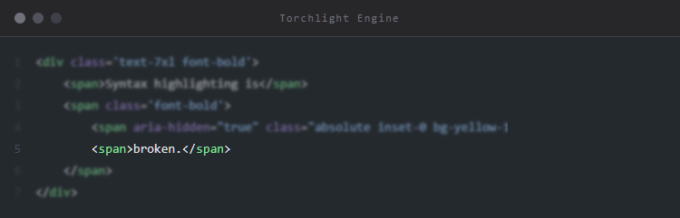

Annotations can be used with plain text and JSON, despite them having no "official" comment support as a language.

### Plain Text Annotations

For plain text, everything is treated "as if" it's a comment, so you can just put the annotation on any line.

```text
spring sunshine
the smell of waters
from the stars

deep winter [tl! focus:2]
the smell of a crow
from the stars

beach to school
the smell of water
in the sky
```

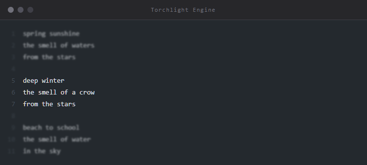

#### JSON Annotations

JSON uses the double slash // comment style, even though it's not official spec. Forgive us.

```text
{
    "torchlightAnnotations": true,
    "lineNumbers": true, // [tl! focus:2]
    "lineNumbersStart": 1,
    "lineNumbersStyle": "text-align: right; -webkit-user-select: none; user-select: none;",
    "summaryCollapsedIndicator": "...",

    "diffIndicators": false,
    "diffIndicatorsInPlaceOfLineNumbers": true,
}
```

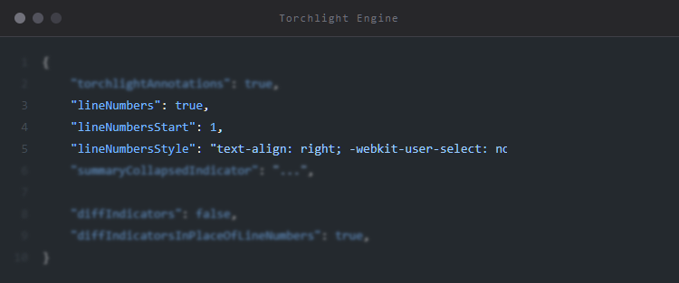

### Ranges

Sometimes you want to apply an annotation to a whole set of lines, without having to add dozens of comments.

We have provided several different methods to achieve this, so you may pick the one that best fits your use case.

#### Annotation Range Cheat Sheet

```text
highlight          -- This line only

highlight:start    -- The start of an open ended range
highlight:end      -- The end of an open ended range

highlight:10       -- This line, and the 10 following lines
highlight:-10      -- This line, and the 10 preceding lines

highlight:1,10     -- Start one line down, highlight 10 lines total
highlight:-1,10    -- Start one line up, highlight 10 lines total
```

#### Single Lines

By default, every annotation applies only to the line that it lives on.

For example, this will only highlight the line it is on, line number 2.

```php
return [
    'extensions' => [ // [tl! highlight]
        // Add attributes straight from markdown.
        AttributesExtension::class,
        
        // Add Torchlight syntax highlighting.
        TorchlightExtension::class,
    ]
]
```

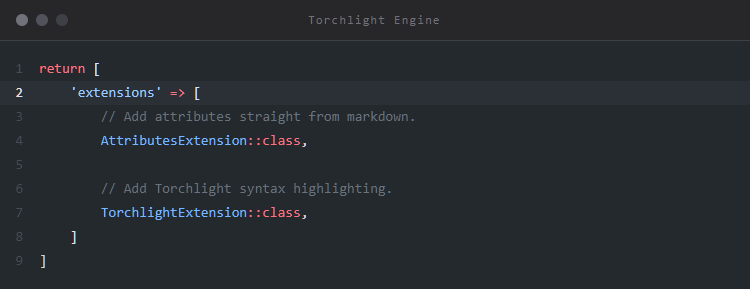

#### N-Many Lines

To highlight the current line, and the next `N` lines, you may use the `:N` modifier.

In this example, we will highlight the current line (2) and the next two lines (3 & 4).

```php
return [
    'extensions' => [ // [tl! highlight:2]
        // Add attributes straight from markdown.
        AttributesExtension::class,
        
        // Add Torchlight syntax highlighting.
        TorchlightExtension::class,
    ]
]
```

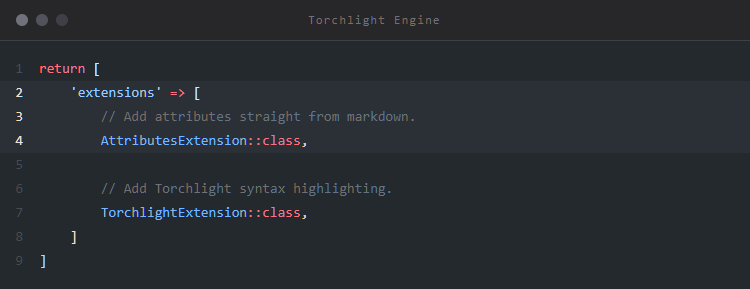

This also works with negative numbers `:-N`

```php
return [
    'extensions' => [
        // Add attributes straight from markdown.
        AttributesExtension::class,  // [tl! highlight:-2]
        
        // Add Torchlight syntax highlighting.
        TorchlightExtension::class,
    ]
]
```

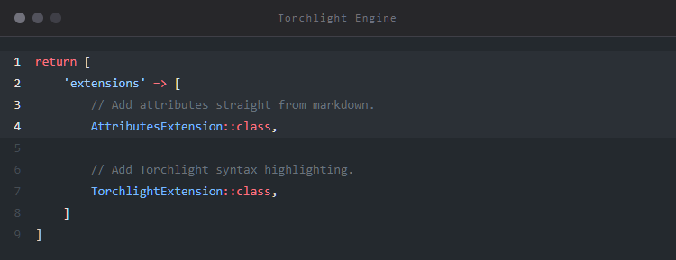

#### Offset and Length

If you have a bit of code that is hard to reach with a comment, perhaps a heredoc, you can use the `focus:M,N` syntax where `M` is the number of lines above or below the current line, and `N` is the number of lines to highlight.

Here we're going to start 6 lines down, and highlight 3 lines total.

```php
// This is a long bit of text, hard to highlight the middle. [tl! highlight:6,3]
return <<<EOT
spring sunshine
the smell of waters
from the stars

deep winter
the smell of a crow
from the stars

beach to school
the smell of water
in the sky
EOT;
```

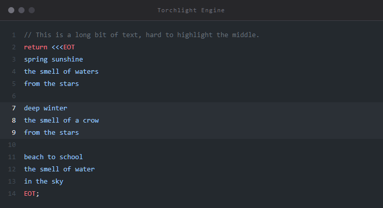

You can also start from the bottom by using a negative offset. We'll start 7 lines up and highlight 3 lines again.

```php
// This is a long bit of text, hard to highlight the middle. 
return <<<EOT
spring sunshine
the smell of waters
from the stars

deep winter
the smell of a crow
from the stars

beach to school
the smell of water
in the sky
EOT; // [tl! highlight:-7,3]
```


#### Start and End

Sometimes you want to define a start and end line, and annotate everything in the middle.

You may do this with the `:start` and `:end` modifiers.

```php
return [
    'extensions' => [  // Start here [tl! highlight:start]
        // Add attributes straight from markdown.
        AttributesExtension::class, 
        
        // Add Torchlight syntax highlighting.
        TorchlightExtension::class,
    ] // End here [tl! highlight:end]
]
```

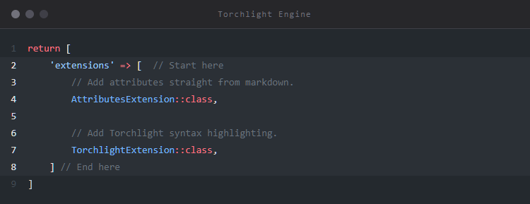

#### Supported Annotations

All of them! Ranges are supported for all of the Torchlight annotation keywords:

* `highlight`
* `focus`
* `insert`
* `remove`
* `collapse`
* `autolink`
* `reindex`

Custom classes and IDs are supported as well.

* `.my-custom-class:start`
* `.my-custom-class:end`
* `.my-custom-class:1,10`
* `.my-custom-class:3`
* `.my-custom-class:-1,5`

Torchlight also plays nicely with prefixed Tailwind classes:

* `.sm:py-4:start`
* `.sm:py-4:end`
* `.sm:py-4:1,10`
* `.sm:py-4:3`
* `.sm:py-4:-1,5`

Remember that an HTML ID must be unique on the page, so while it's unlikely that you'd want to apply an ID to a _range_ of lines, you may want to apply it to a line you cannot reach.

For example, to reach four lines down and add an ID of `popover-trigger`, you could do the following:

```php
// Reach down 4 lines, add the ID to one line [tl! #popover-trigger:4,1]
return <<<EOT
spring sunshine
the smell of waters
from the stars

deep winter
the smell of a crow
from the stars

beach to school
the smell of water
in the sky
EOT;
```

### Highlighting Lines

The `highlight` annotation will pull the line highlight background color from your chosen theme, and apply it to the background of the line, drawing focus to that specific line:

```php
return [
    'extensions' => [
        // Add attributes straight from markdown. [tl! highlight:1]
        AttributesExtension::class,
        
        // Add Torchlight syntax highlighting.
        TorchlightExtension::class,
    ]
]
```

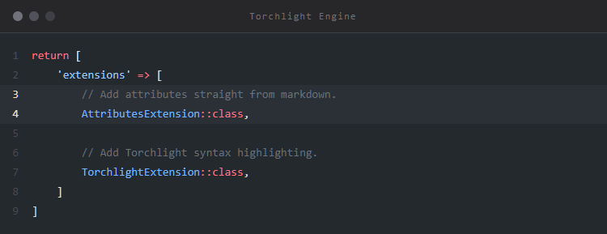

It also applies a `line-highlight` class to the line.

If you have _any_ lines highlighted, Torchlight will add a `has-highlight-lines` class to your `code` tag.

Every theme is different in the way that it chooses to represent highlighted lines, so be sure to try a few out.

#### Alternative Highlight Class

If you don't like the highlight color that your theme uses, you can apply a [custom class](#classes-and-ids) instead, e.g. `.highlight` or `.foobar`:

```php
return [
    'extensions' => [
        // Add attributes straight from markdown. [tl! .highlight]
        AttributesExtension::class,
        
        // Add Torchlight syntax highlighting. [tl! .foobar.bazbuz]
        TorchlightExtension::class,
    ]
]
```

#### Highlight Shorthand

If you find typing `highlight` prohibitively slow (who has the time?), you can use `~~` as a shorthand.

```php
return [
    'extensions' => [
        // Add attributes straight from markdown. [tl! ~~:1]
        AttributesExtension::class,
        
        // Add Torchlight syntax highlighting.
        TorchlightExtension::class,
    ]
]
```

### Focusing

The `focus` annotation adds a `line-focus` class to the line, and a `has-focus-lines` class to your code tag.

Used in conjunction with the CSS below, every line that you've applied `[tl! focus]` to will be sharp and clear, and the rest will be blurry and dim. If a user hovers over the code block, everything will come into focus.

```php
return [
    'extensions' => [
        // Add attributes straight from markdown.
        AttributesExtension::class,
        
        // Add Torchlight syntax highlighting. [tl! focus]
        TorchlightExtension::class, // [tl! focus]
    ]
]
```


#### Focusing Shorthand

As an alternative to `focus`, you can use `**`.

```php
return [
    'extensions' => [
        // Add attributes straight from markdown.
        AttributesExtension::class,
        
        // Add Torchlight syntax highlighting. [tl! **]
        TorchlightExtension::class, // [tl! **]
    ]
]
```

#### Focusing CSS

Here is the CSS required to achieve the focus effect:

```css
/* 
  Blur and dim the lines that don't have the `.line-focus` class, 
  but are within a code block that contains any focus lines. 
*/ 
.torchlight.has-focus-lines .line:not(.line-focus) {
    transition: filter 0.35s, opacity 0.35s;
    filter: blur(.095rem);
    opacity: .65;
}

/*
  When the code block is hovered, bring all the lines into focus.
*/
.torchlight.has-focus-lines:hover .line:not(.line-focus) {
    filter: blur(0px);
    opacity: 1;
}
```

### Collapsing

Sometimes in your documentation or a blog post, you want to focus the reader on a specific block of code, but allow them to see the rest of the code if they need to.

One way you can achieve that is by using the `focus` annotation to blur the irrelevant code, but you can also use Torchlight to _collapse_ blocks of code using native HTML, _no JavaScript required_.

In this example, we're going to collapse the `heading_permalink` options, as they might distract from the point of the example.

We can do this by using the `collapse` annotation:

```php
return [
    'heading_permalink' => [ // [tl! collapse:start]
        'html_class' => 'permalink',
        'id_prefix' => 'user-content',
        'insert' => 'before',
        'title' => 'Permalink',
        'symbol' => '#',
    ], // [tl! collapse:end]

    'extensions' => [
        // Add attributes straight from markdown.
        AttributesExtension::class,
        
        // Add Torchlight syntax highlighting.
        TorchlightExtension::class,
    ]
]
```

**Collapsed section closed:**

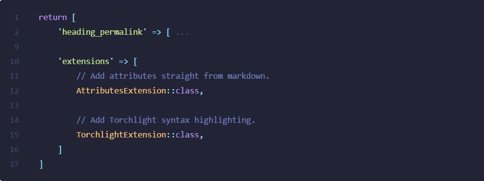

**Collapsed section open:**

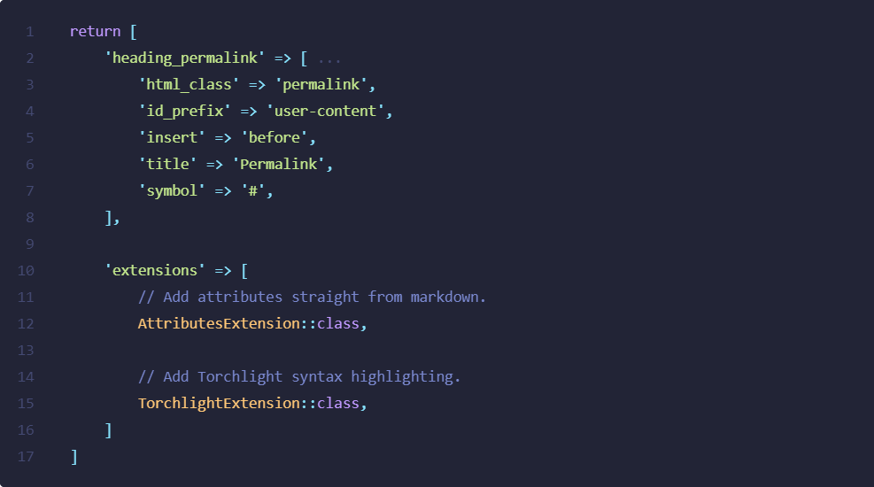

These lines will now be wrapped in a `summary` / `detail` pair of tags, that allows the user to natively toggle the open and closed start of the block. Torchlight will also add a `has-summaries` class to your `code` tag anytime you define a summary range.

You can use the `start` `end` method of defining a range, or any of the other [range modifiers](#ranges).

Here's an example using the `N-many` modifier to collapse the 5 lines following the annotation:

```php
return [
    'heading_permalink' => [ // [tl! collapse:5]
        'html_class' => 'permalink',
        'id_prefix' => 'user-content',
        'insert' => 'before',
        'title' => 'Permalink',
        'symbol' => '#',
    ],

    'extensions' => [
        // Add attributes straight from markdown.
        AttributesExtension::class,
        
        // Add Torchlight syntax highlighting.
        TorchlightExtension::class,
    ]
]
```

#### Customizing the Summary Text

By default, Torchlight will add a subtle `...` in place of the collapsed text, but you can customize that by passing in the `summaryCollapsedIndicator` options:

```php
// torchlight! {"summaryCollapsedIndicator": "Click to show ]"}
return [
    'heading_permalink' => [ // [tl! collapse:start]
        'html_class' => 'permalink',
        'id_prefix' => 'user-content',
        'insert' => 'before',
        'title' => 'Permalink',
        'symbol' => '#',
    ], // [tl! collapse:end]

    'extensions' => [
        // Add attributes straight from markdown.
        AttributesExtension::class,
        
        // Add Torchlight syntax highlighting.
        TorchlightExtension::class,
    ]
]
```

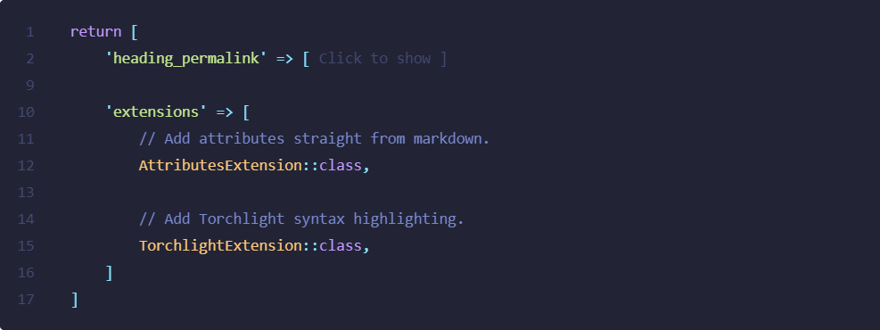

#### Collapsing Required CSS

You will need to add the following CSS to your page to accomplish the hiding:

```css
.torchlight summary:focus {
    outline: none;
}

/* Hide the default markers, as we provide our own */
.torchlight details > summary::marker,
.torchlight details > summary::-webkit-details-marker {
    display: none;
}

.torchlight details .summary-caret::after {
    pointer-events: none;
}

/* Add spaces to keep everything aligned */
.torchlight .summary-caret-empty::after,
.torchlight details .summary-caret-middle::after,
.torchlight details .summary-caret-end::after {
    content: " ";
}

/* Show a minus sign when the block is open. */    
.torchlight details[open] .summary-caret-start::after {
    content: "-"; 
}

/* And a plus sign when the block is closed. */    
.torchlight details:not([open]) .summary-caret-start::after {
    content: "+"; 
}

/* Hide the [...] indicator when open. */    
.torchlight details[open] .summary-hide-when-open {
    display: none;
}

/* Show the [...] indicator when closed. */    
.torchlight details:not([open]) .summary-hide-when-open {
    display: initial;
}
```

#### Default to Open

By default, when you define a collapse range it will be collapsed. If you want to define the range but default it to open, you can add the `open` keyword:

```php
return [
    'heading_permalink' => [ // [tl! collapse:start open]
        'html_class' => 'permalink',
        'id_prefix' => 'user-content',
        'insert' => 'before',
        'title' => 'Permalink',
        'symbol' => '#',
    ], // [tl! collapse:end]

    'extensions' => [
        // Add attributes straight from markdown.
        AttributesExtension::class,
        
        // Add Torchlight syntax highlighting.
        TorchlightExtension::class, 
    ]
]
```

### Diffs

To demonstrate the addition and removal of lines, you can use the `add` and `remove` keywords.

Torchlight will look through your theme to find the appropriate foreground and background colors to apply to the specific lines.

It will also apply `line-add` and `line-remove` classes to the individual lines. To the code element it will apply the `has-diff-lines` class, and potentially `has-add-lines` and `has-remove-lines`.

```php
return [
    'extensions' => [
        // Add attributes straight from markdown.
        AttributesExtension::class,
        
        // Add Torchlight syntax highlighting.
        SomeOtherHighlighter::class, // [tl! remove]
        TorchlightExtension::class, // [tl! add]
    ]
]
```

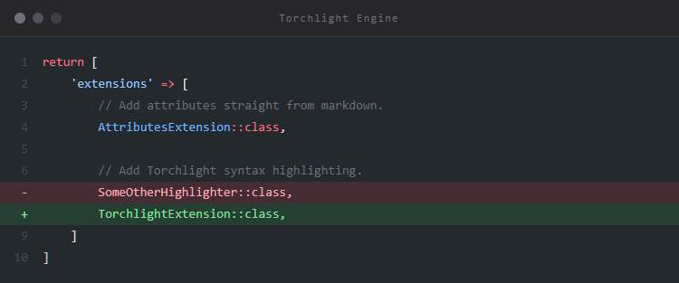

#### Diff Shorthand

You can use `++` and `--` as shorthand for `add` and `remove`.

```text
return [
    'extensions' => [
        // Add attributes straight from markdown.
        AttributesExtension::class,
        
        // Add Torchlight syntax highlighting.
        SomeOtherHighlighter::class, // [tl! --]
        TorchlightExtension::class, // [tl! ++]
    ]
]
```

#### Removing Diff Indicators

Here is an example of a diff, with _no_ indicators.

```php
// torchlight! {"diffIndicators": false}
return [
    'extensions' => [
        // Add attributes straight from markdown.
        AttributesExtension::class,
        
        // Add Torchlight syntax highlighting.
        SomeOtherHighlighter::class, // [tl! remove]
        TorchlightExtension::class, // [tl! add]
    ]
]
```


Notice that the colors of the lines just change to the standard colors you expect to see.

If you'd like to show the `+`/`-` indicators, you can do so by turning them on at the block level, or globally in your client's configuration.

For these examples we'll do it at the block level so we can see how it works.

Let's change the behavior by sending `diffIndicators: true` to the API.

```php
// torchlight! {"diffIndicators": true}
return [
    'extensions' => [
        // Add attributes straight from markdown.
        AttributesExtension::class,
        
        // Add Torchlight syntax highlighting.
        SomeOtherHighlighter::class, // [tl! remove]
        TorchlightExtension::class, // [tl! add]
    ]
]
```

Take a look where the line numbers are and notice the indicators:

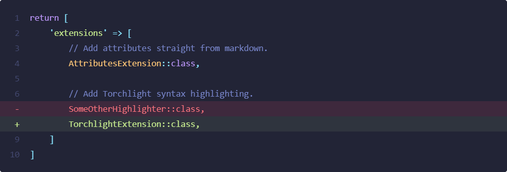

> [!NOTE]
> If you'd like to reindex the line numbers after a diff, you [can do that](#reindexing-line-numbers).

#### Standalone Diff Indicators

By default, we swap them in place of the line numbers, but you can also disable that behavior by using the extremely descriptive, verbose option `diffIndicatorsInPlaceOfLineNumbers`.

```php
// torchlight! {"diffIndicators": true, "diffIndicatorsInPlaceOfLineNumbers": false}
return [
    'extensions' => [
        // Add attributes straight from markdown.
        AttributesExtension::class,
        
        // Add Torchlight syntax highlighting.
        SomeOtherHighlighter::class, // [tl! remove]
        TorchlightExtension::class, // [tl! add]
    ]
]
```

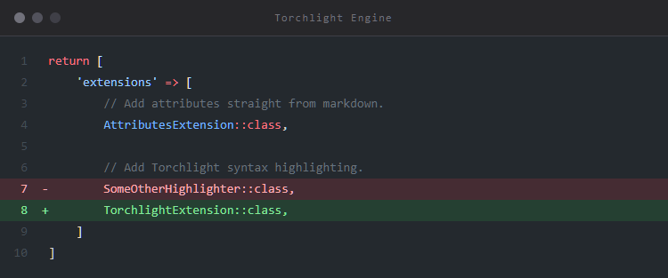

Now the line numbers remain, and the indicators get their own column.

Each standalone indicator has the `diff-indicator` class applied, along with one of the following:

* `diff-indicator-add` - For lines that were added
* `diff-indicator-remove` - For lines that were removed
* `diff-indicator-empty` - For lines that were unchanged

#### Diff Indicators Without Line Numbers

In the scenario where you:

* turn _on_ diff indicators
* turn _off_ line numbers
* turn _on_ diff indicators in place of line numbers (this is the default)

Your indicators will still show up in the `line-number` classes, not the standalone classes mentioned above.

The reason we have chosen this approach is so that you don't have to add the `diff-indicator` styles _ever_ when you choose to put your indicators in the line number column.

#### Diff Ranges

The diff annotations support the entire set of [range modifiers](#ranges) to help you quickly annotate a whole set of lines.

Check out the [range docs](#ranges) for more details, but here is a quick cheat sheet.

```text
add          -- This line only

add:start    -- The start of an open ended range
add:end      -- The end of an open ended range

add:10       -- This line, and the 10 following lines
add:-10      -- This line, and the 10 preceding lines

add:1,10     -- Start one line down, highlight 10 lines total
add:-1,10    -- Start one line up, highlight 10 lines total
```

### Classes and IDs

You can add your own custom classes by preceding them with a `.`, or add an ID with a `#`.

```php
return [
    'extensions' => [
        // Add attributes straight from markdown.
        AttributesExtension::class,
        
        // Add Torchlight syntax highlighting. [tl! highlight .animate-pulse]
        TorchlightExtension::class, // [tl! highlight .font-bold .italic .animate-pulse #pulse]
    ]
]
```

You can space out your classes like we did above, or just run them all together: `.font-bold.italic.animate-pulse#pulse`

Torchlight also supports Tailwind + the Tailwind JIT syntax, so you can do pretty much anything you can think of:

```text
torchlight! {"torchlightAnnotations": false}
ID only                   // [tl! #id]
ID + Class                // [tl! #id.pt-4]
Negative Tailwind classes // [tl! .-pt-4 .pb-8]
ID + Classes Mixed        // [tl! .-pt-4#id1.pb-8]
Tailwind Prefixes         // [tl! .sm:pb-8]
Tailwind JIT              // [tl! .sm:pb-[calc(8px-4px)]]
Tailwind JIT              // [tl! .pr-[8px]]
Tailwind JIT + ID         // [tl! .-pt-4.pb-8.pr-[8px] #id]
```

#### Using Range Modifiers

You can also apply any [range modifiers](#ranges) to custom classes.

```php
return [
    'extensions' => [
        // Add attributes straight from markdown.
        AttributesExtension::class,
        
        // Add Torchlight syntax highlighting. [tl! .bg-gray-900:-1,4 .animate-pulse:1]
        TorchlightExtension::class,
    ]
]
```

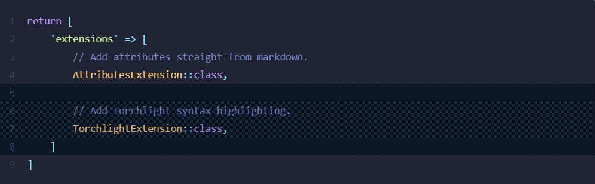

Check out the [range docs](#ranges) for more details, but here is a quick cheat sheet.

```text
.class          -- This line only

.class:start    -- The start of an open ended range
.class:end      -- The end of an open ended range

.class:10       -- This line, and the 10 following lines
.class:-10      -- This line, and the 10 preceding lines

.class:1,10     -- Start one line down, highlight 10 lines total
.class:-1,10    -- Start one line up, highlight 10 lines total
```

Remember that an HTML ID must be unique on the page, so while it's unlikely that you'd want to apply an ID to a _range_ of lines, you may want to apply it to a line you cannot reach.

For example, to reach four lines down and add an ID of `popover-trigger`, you could do the following:

```text
// Reach down 4 lines, add the ID to one line [tl! #popover-trigger:4,1]
return <<<EOT
spring sunshine
the smell of waters
from the stars

deep winter
the smell of a crow
from the stars

beach to school
the smell of water
in the sky
EOT;
```

#### Character Ranges

You may also apply classes and IDs to character ranges on the current line by prefixing your range with the `c` character. Instead of supplying a range of line numbers, we supply the *character* range.

For example, the range `.inner-highlight:c26,34` instructs Torchlight to wrap the tokens from characters 26 through 34 with the `inner-highlight` class:

```text
<script src="//unpkg.com/alpinejs" defer></script> <!-- [tl! .inner-highlight:c26,34] -->
 
<div x-data="{ open: false }">
    <button @click="open = true">Expand</button>
 
    <span x-show="open">
        Content...
    </span>
</div>
```

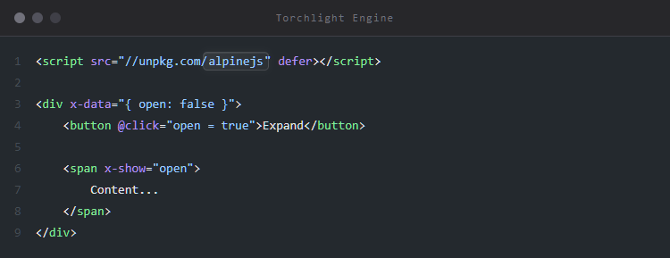

> [!NOTE]
> You will need to add the desired CSS to style your character ranges.

### Auto-linking URLs

Sometimes your code contains URLs to other supporting documentation. It's a nice experience for the reader if those URLs were actually links instead of having to copy-paste them.

It's a little thing, but Torchlight sweats the little things so you don't have to.

Using the `autolink` annotation, Torchlight will look for URLs and turn them into links for you.

```php
/**
 * @see https://youtu.be/LEXIYgOXsRU?si=wDC7GxC1y3pNdHjZ&t=69. [tl! autolink]
 */

$link = 'https://youtu.be/LEXIYgOXsRU?si=wDC7GxC1y3pNdHjZ&t=69'; // [tl! autolink]
```

The resulting link will look like this (color will change depending on your theme):

```html
<a target="_blank" 
   rel="noopener" 
   class="torchlight-link" 
   style="color: #032F62;" 
   href="https://youtu.be/LEXIYgOXsRU?si=wDC7GxC1y3pNdHjZ&t=6">https://youtu.be/LEXIYgOXsRU?si=wDC7GxC1y3pNdHjZ&t=6</a>
```

Torchlight adds a `torchlight-link` class, and `rel` + `target` attributes.

The `rel=noopener` attribute ensures that no a malicious website doesn't have access to the `window.opener` property. Although this is less of a concern now with modern browsers, we still want you to be covered.

Read more about `rel=noopener` at [mathiasbynens.github.io/rel-noopener](https://mathiasbynens.github.io/rel-noopener/).

#### Link Requirements

Your URL must start with one of the following in order to match:

* `http:`
* `https:`
* `www.`

#### Link Ranges

The auto-link annotation supports the entire set of [range modifiers](#ranges) to help you quickly annotate a whole set of lines.

Check out the [range docs](#ranges) for more details, but here is a quick cheat sheet.

 ```text
 autolink          -- This line only
 
 autolink:start    -- The start of an open ended range
 autolink:end      -- The end of an open ended range
 
 autolink:10       -- This line, and the 10 following lines
 autolink:-10      -- This line, and the 10 preceding lines
 
 autolink:1,10     -- Start one line down, highlight 10 lines total
 autolink:-1,10    -- Start one line up, highlight 10 lines total
 ```

### Reindexing Line Numbers

Now we're really getting into the weeds, but that's exactly what Torchlight is here for.

Sometimes it really matters what the line number is that goes along with your code sample. In the case where you can't get it right, you might be tempted to turn them off altogether.

Torchlight offers a few ways to _reindex_ the lines, using the `reindex` annotation.

To reindex a line, you will add the `reindex` annotation. This annotation is a little bit different than the others, because it accepts an argument in parenthesis.

Here are a few examples:

* `reindex(-1)`: whatever this line number _would_ have been, reduce it by one
* `reindex(+1)`: whatever this line number _would_ have been, increment it by one
* `reindex(5)`: regardless of what number this should be, make it `5`
* `reindex(null)`: don't show a line number here.

#### Manually Setting a New Number

To just outright set a new number, use the `reindex(N)` style:

```text
'a';
'b';
'c';
'x'; // [tl! reindex(24)]
'y';
'z';
```

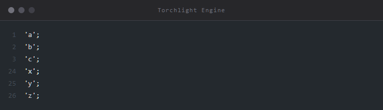

Torchlight will continue with the next number after the one you set.

#### No Line Number at All

If you want a line to have no line number, use the `reindex(null)` annotation:

```text
'a';
'b';
'c';
// Lots of letters... [tl! reindex(null)]
'x'; // [tl! reindex(24)]
'y';
'z';
```

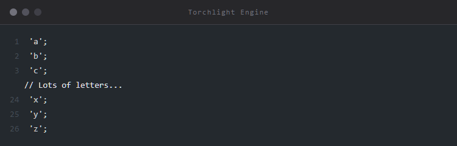

If you don't immediately reindex, Torchlight just treats that line as if it doesn't exist for numbering purposes.

```text
'a';
'b';
'c';
// Lots of letters... [tl! reindex(null)]
'x';
'y';
'z';
```

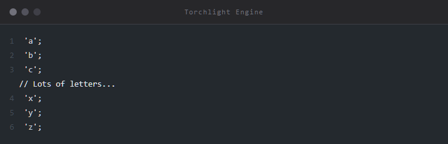

#### Relative Line Number Changes

Often times it's easiest to think in terms of "increment" or "decrement" instead of thinking in absolutes. Especially as time goes on and your samples may change, it's nice to have the relative numbers always work.

This can be a really nice touch when showing diffs, to keep the numbering legit.

To change the numbers relatively, use the `reindex(+N)` and `reindex(-N)` styles.

```text
// torchlight! {"diffIndicatorsInPlaceOfLineNumbers": false}
return [
    'extensions' => [
        // Add attributes straight from markdown.
        AttributesExtension::class,
        
        // Add Torchlight syntax highlighting.
        SomeOtherHighlighter::class, // [tl! remove]
        TorchlightExtension::class, // [tl! add reindex(-1)]
    ]
]
```


Of course, it doesn't have to just be `1`, it could be any number.

```php
return [
    'extensions' => [
        // Add attributes straight from markdown.
        AttributesExtension::class,
        
        // Add Torchlight syntax highlighting.
        SomeOtherHighlighter::class, // [tl! remove]
        TorchlightExtension::class, // [tl! add reindex(+1000)]
    ]
]
```

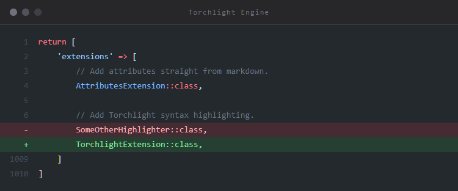

#### Reindexing with Range Modifiers

The `reindex` annotation _does_ work with the [annotation range modifiers](ranges), so you can do some pretty wacky stuff.

If you wanted to reach down several lines and apply a reindex, you totally could!

Here we are going to reach down 6 lines, and apply a +5 reindex to 1 line only.

```text
// This is a long bit of text, hard to reindex the middle. [tl! reindex(+5):6,1]
return <<<EOT
spring sunshine
the smell of waters
from the stars

deep winter
the smell of a crow
from the stars

beach to school
the smell of water
in the sky
EOT; // [tl! highlight:-7,3]
```


Or if you wanted to null out the second stanza, you could do that also.

```text
// This is a long bit of text, hard to reindex the middle. [tl! reindex(null):5,5]
return <<<EOT
spring sunshine
the smell of waters
from the stars

deep winter
the smell of a crow
from the stars

beach to school
the smell of water
in the sky
EOT; // [tl! highlight:-7,3]
```

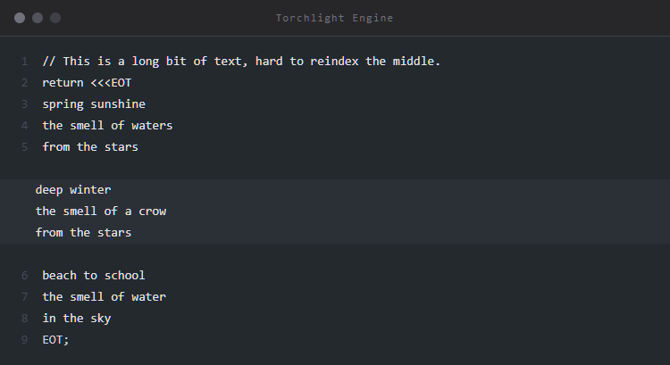

Why you would ever want to do this, I have no idea. But if you want to, you can!

#### Reindex Differences Between Torchlight API

Torchlight Engine makes some breaking changes when compared to the behavior of the Torchlight API. This was done to make the behavior of reindexing with annotation ranges more predictable and consistent with the other annotations; there should be little to no impact on your code examples unless you are doing some crazy things.

Be sure to double check any reindex examples if you are migrating from the Torchlight API!

## Options

### Line Numbers

### Summary Indicator

### Disabling Annotations

## Credits

* [Aaron Francis](https://github.com/aarondfrancis)
* [John Koster](https://github.com/JohnathonKoster)
* [Ryan Chandler](https://github.com/ryangjchandler) for building [Phiki](https://github.com/phikiphp/phiki), making this project feasible.

## License

The Torchlight Engine is free software, released under the MIT license.

Themes and grammars may be governed by their own license.
