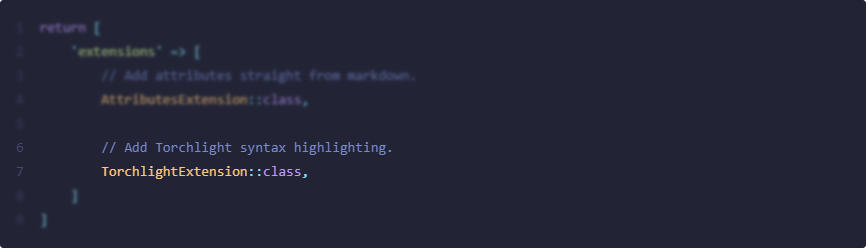

Torchlight Engine brings Torchlight's code annotation syntax to PHP, built on top of the excellent [Phiki](https://github.com/phikiphp/phiki) syntax highlighting package. No node or API required.

Torchlight enables you to add annotations to your code, drawing your reader's attention to specific parts, highlighting lines, visualizing diffs, and much more. Combined with the syntax highlighting provided by Phiki, Torchlight is a perfect fit for technical blogs, documentation, and so much more.

Torchlight annotations are written as comments in the language of your code sample, eliminating all red squigglies and errors within your editor or IDE.

As an example, here is how we could focus our reader's attention on lines 6 and 7:

```php
return [
    'extensions' => [
        // Add attributes straight from markdown.
        AttributesExtension::class,

        // Add Torchlight syntax highlighting. [tl! focus]
        TorchlightExtension::class, // [tl! focus]
    ]
]
```

When rendered, our readers would be presented with something like the following:



How simple is that? We're pretty proud of it and know you'll love it, too.

* [Installation](#installation)
* [Getting Started](#getting-started)
  * [Laravel](#laravel)
  * [Statamic](#statamic)
  * [Notes on User Provided Content](#notes-on-user-provided-content)
* [CSS and Theming](#css-and-theming)
  * [Standard CSS](#standard-css)
  * [Tailwind](#tailwind)
  * [Dark Mode](#dark-mode)

## Installation

You may install Torchlight Engine via Composer:

```bash
# TODO: Update once added to the registry.
```

## Getting Started

Torchlight Engine provides a `league/commonmark` extension, making it simple to start using Torchlight in your markdown-powered content.

You may register the extension with any CommonMark `Environment` object like so:

````php
use League\CommonMark\Environment\Environment;
use League\CommonMark\Extension\CommonMark\CommonMarkCoreExtension;
use League\CommonMark\MarkdownConverter;
use Torchlight\Engine\CommonMark\Extension;

$environment = new Environment;
$environment
    ->addExtension(new CommonMarkCoreExtension)
    ->addExtension(new Extension('github-light'));

$converter = new MarkdownConverter($environment);
$output = $converter->convert(<<<'MD'
```php
<?php echo 'This is Torchlight'; ?>
```
MD);
````

### Laravel

> [!NOTE]
> This section highlights using the provided CommonMark extension with Laravel. Updated versions of the [Laravel client](https://github.com/torchlight-api/torchlight-laravel) are planned for the future.

You may use the provided CommonMark extension with Laravel's `Str::markdown()` or `str()->markdown()` methods by adding the extension to your method call:

```php
echo str()->markdown('...your markdown content...', extensions: [
    new Extension('github-light'),
]);
```

### Statamic

To integrate Torchlight Engine with Statamic, you may add the CommonMark extension to your desired markdown parser by [adding the extension](https://statamic.dev/extending/markdown#adding-extensions):

```php
<?php
namespace App\Providers;
 
use Illuminate\Support\ServiceProvider;
use Statamic\Facades\Markdown;
use Torchlight\Engine\CommonMark\Extension;
 
class AppServiceProvider extends ServiceProvider
{
    public function boot()
    {
        // Add the Torchlight Engine extension
        Markdown::addExtension(function () {
            return new Extension('synthwave-84');
        });
    }
}
```

### Notes on User Provided Content

[Phiki](https://github.com/phikiphp/phiki) and Torchlight Engine, while incredibly powerful, are still early projects, and it is possible to encounter infinite loops with some grammars and input. As always, you should exercise caution when rendering any user-provided content.

## CSS and Theming

Torchlight handles the highlighting of all of your code for you, but there are a few styles that you will likely need to add to your CSS to make it just right.

This is the CSS we prefer, which sets up some line padding, margin off of the line numbers, and overflow scrolling. Your CSS is totally up to you though!

### Standard CSS

This is the vanilla CSS version, see below for the TailwindCSS version.

```css
/*
 Margin and rounding are personal preferences,
 overflow-x-auto is recommended.
*/
pre {
    border-radius: 0.25rem;
    margin-top: 1rem;
    margin-bottom: 1rem;
    overflow-x: auto;
}

/*
 Add some vertical padding and expand the width
 to fill its container. The horizontal padding
 comes at the line level so that background
 colors extend edge to edge.
*/
pre code.torchlight {
    display: block;
    min-width: -webkit-max-content;
    min-width: -moz-max-content;
    min-width: max-content;
    padding-top: 1rem;
    padding-bottom: 1rem;
}

/*
 Horizontal line padding to match the vertical
 padding from the code block above.
*/
pre code.torchlight .line {
    padding-left: 1rem;
    padding-right: 1rem;
}

/*
 Push the code away from the line numbers and
 summary caret indicators.
*/
pre code.torchlight .line-number,
pre code.torchlight .summary-caret {
    margin-right: 1rem;
}
```

### Tailwind

Here is the Tailwind version:

```css
/*
 Margin and rounding are personal preferences,
 overflow-x-auto is recommended.
*/
pre {
    @apply my-4 rounded overflow-x-auto;
}

/*
 Add some vertical padding and expand the width
 to fill its container. The horizontal padding
 comes at the line level so that background
 colors extend edge to edge.
*/
pre code.torchlight {
    @apply block py-4 min-w-max;
}

/*
 Horizontal line padding.
*/
pre code.torchlight .line {
    @apply px-4;
}

/*
 Push the code away from the line numbers and
 summary caret indicators.
*/
pre code.torchlight .line-number,
pre code.torchlight .summary-caret {
    @apply mr-4;
}
```

### Dark Mode

Torchlight Engine utilizes Phiki for syntax highlighting, and recommends using it's multi-theme support for dark mode.

When instantiating an instance of the CommonMark extension, you may supply multiple themes like so:

```php
<?php

use Torchlight\Engine\CommonMark\Extension;

$extension = new Extension([
    'light' => 'github-light',
    'dark' => 'github-dark',
]);
```

The first entry, `light` in this case, will be used as the default theme. Other themes in the array may be conditionally rendered with CSS.

**Query-based dark mode:**

```css
@media (prefers-color-scheme: dark) {
    code.torchlight {
        background-color: var(--phiki-dark-background-color) !important;
    }

    .phiki,
    .phiki span {
        color: var(--phiki-dark-color) !important;
        font-style: var(--phiki-dark-font-style) !important;
        font-weight: var(--phiki-dark-font-weight) !important;
        text-decoration: var(--phiki-dark-text-decoration) !important;
    }
}
```

**Class-based dark mode:**

```css
html.dark code.torchlight {
    background-color: var(--phiki-dark-background-color) !important;
}

html.dark .phiki,
html.dark .phiki span {
    color: var(--phiki-dark-color) !important;
    font-style: var(--phiki-dark-font-style) !important;
    font-weight: var(--phiki-dark-font-weight) !important;
    text-decoration: var(--phiki-dark-text-decoration) !important;
}
```

You can learn more about rendering multiple themes with Phiki [here](https://github.com/phikiphp/phiki?tab=readme-ov-file#multi-theme-support). The only change when rendering multiple themes with Torchlight Engine is the placement of the `background-color` property, to prevent conflicts with some annotations, such as diff add and remove.

## Credits

* [Aaron Francis](https://github.com/aarondfrancis)
* [John Koster](https://github.com/JohnathonKoster)
* [Ryan Chandler](https://github.com/ryangjchandler) for building [Phiki](https://github.com/phikiphp/phiki), making this project feasible.

## License

The Torchlight Engine is free software, released under the MIT license.

Themes and grammars may be governed by their own license.
